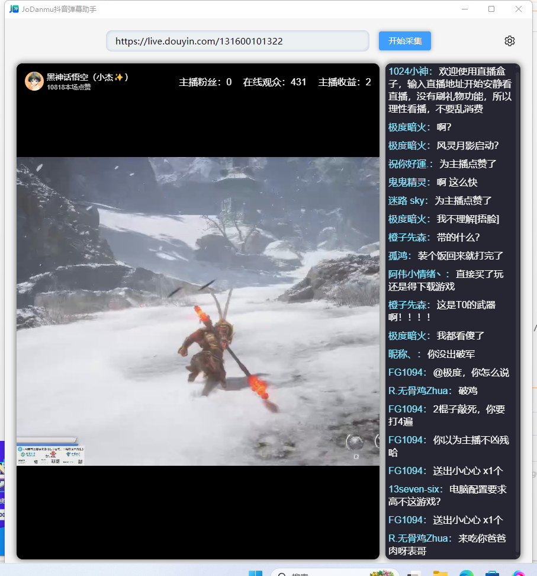
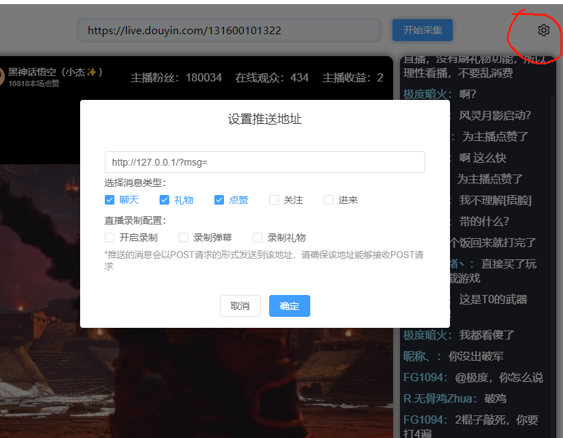

# 飞鹰抖音弹幕助手

飞鹰弹幕助手用于对直播间互动弹幕解析及数据接收实例，仅供学习研究技术，切勿传播切勿用于非法用途，后果自负！

目前支持抖音直播间发言、点赞、礼品、关注、进来几项动作，未来将持续升级支持快手等直播间。

主体代码基于开源直播盒子 [LiveBox](https://github.com/Sjj1024/LiveBox)实现核心代码。

本仓补充了弹幕解析推送实现。


#### 软件架构
使用JavaScript、ts、node.js、vue3、element-plus、tauri实现Windows窗口程序开发。

## 常见问题

mac 电脑提示：已损坏,无法打开,你应该将它移到废纸篓，执行下面这条命名即可解决：

```
sudo xattr -r -d com.apple.quarantine /Applications/FyLiveBox.app
```

界面如下：




#### 弹幕解析内容接收


配置弹幕解析内容接收接口：




#### 源码运行及二开

1. 开发工具
2. 安装node.js
3. 安装rustup
4. 安装tauri-apps/cli
5. 测试命令： npm run tauri dev
6. 打包命令： npm run tauri build

## 全平台编译打包操作

打 tag 发布到 github 的 action 打包全平台的安装程序。

在你的项目根目录下创建一个名为 .github/workflows 的文件夹，并在这个文件夹内添加一个新的 YAML 文件，比如 build.yml。
将本项目的同名文件内容复制过去然后发布tag即可自动打包。这个文件将定义 GitHub Actions 的工作流程

例如：

```
git tag v1.0.0
git push --tag

查看tag:
git tag

删除tag:
git tag -d v1.0.0
git push --delete origin v1.0.0
```

### 其他
- 欢迎提PR一起完善项目
- 作者微信：cyokup
- 承接网站开发，小程序开发，微信公众号开发，APP开发等定制开发项目
