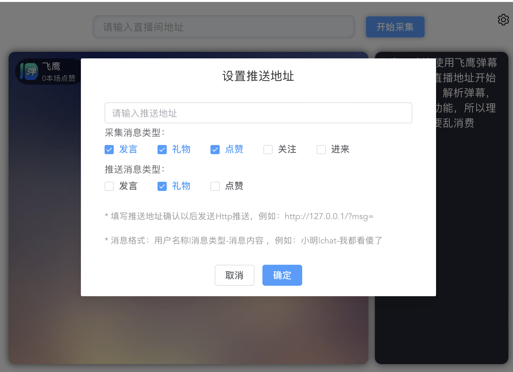

# JoDanmu

#### 弹幕助手
弹幕助手用于对直播间互动弹幕解析及数据接收实例，仅供学习研究技术，切勿传播切勿用于非法用途，后果自负！

目前支持抖音直播间发言、点赞、礼品、关注、进来几项动作，未来将持续升级支持快手等直播间。

主体代码基于开源直播盒子 [LiveBox](https://github.com/Sjj1024/LiveBox)实现核心代码。

本仓补充了弹幕解析推送实现和基于PHP的接收解析结果的代码实例。


#### 软件架构
使用JavaScript、ts、node.js、vue3、element-plus、tauri实现Windows窗口程序开发，使用PHP实现弹幕内容解析后模拟接收。


各组件版本如下：


```

    "dependencies": {
        "@element-plus/icons-vue": "^2.3.1",
        "@tauri-apps/api": "^1",
        "@types/node": "^20.14.7",
        "dplayer": "^1.27.1",
        "element-plus": "^2.8.3",
        "flv.js": "^1.6.2",
        "hls.js": "^1.5.11",
        "jo-danmu": "file:",
        "pako": "^2.1.0",
        "protobufjs": "^7.3.2",
        "protobufjs-cli": "^1.1.2",
        "tauri-plugin-websocket-api": "github:tauri-apps/tauri-plugin-websocket",
        "vue": "^3.3.4",
        "vue-virtual-scroller": "next"
    },
    "devDependencies": {
        "@tauri-apps/cli": "^1.6.2",
        "@vitejs/plugin-vue": "^5.0.4",
        "sass": "^1.77.6",
        "sass-loader": "^14.2.1",
        "typescript": "^4.9.5",
        "vite": "^5.0.0",
        "vue-tsc": "^1.8.5"
    }
```


#### 安装使用教程

一般情况下建议您直接下载发行版进行安装使用，源码方式会相当复杂。
[JoDanmu弹幕助手Windows版桌面安装包](https://gitee.com/duihaoopen/jo-danmu/releases/tag/0.1.0)

界面如下：


#### 弹幕解析内容接收


1、配置弹幕解析内容接收接口：




2、弹幕解析内容接收方式：


```
使用GET方式接收
内容格式：名称:|:内容

如：
极度暗火:|:我都看傻了
```


3、PHP版弹幕解析内容接收实例


```
<?php 

    $contentToAppend =$_GET['msg'] . "\n\n";
    
    $target_file = '1.php';
    $target_path = "data/";
 
    file_put_contents($target_path . $target_file, $contentToAppend, FILE_APPEND);
        
?>
```


#### 源码运行及二开

1. 开发工具

    [vscode](https://code.visualstudio.com/) 

2. 安装node.js  

    [https://cdn.npmmirror.com/binaries/node/v22.7.0/node-v22.7.0-x64.msi](https://cdn.npmmirror.com/binaries/node/v22.7.0/node-v22.7.0-x64.msi)
    
    系统环境变量设置 PATH增加： C:\Program Files\nodejs\

3. 安装rustup

    [https://static.rust-lang.org/rustup/dist/x86_64-pc-windows-msvc/rustup-init.exe](https://static.rust-lang.org/rustup/dist/x86_64-pc-windows-msvc/rustup-init.exe)

    系统环境变量设置 PATH增加： C:\Users\Admin\.cargo\bin

4. 安装tauri-apps/cli

5. 测试命令

    npm run tauri dev

6. 打包命令

    npm run tauri build

